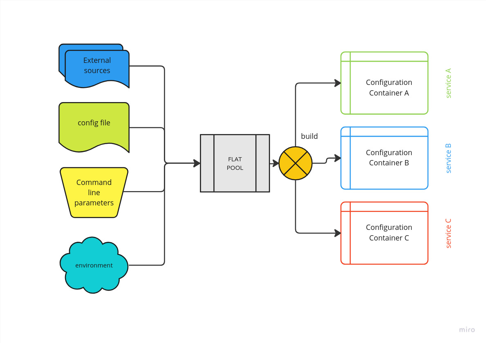

# Flat Config
A dead simple configuration management tool.

The way this configuration manager works is the following:



The code sequence is the following:

 * Create the configuration container required by the application services
 * Create the builder that will check, clean, set default values and turn flat values into Rust typed values.
 * Gather flat data from configuration source (Clap, Config etc.)

```rust
use flat_config::{
   config_setting::{TryUnwrap, ConfigSetting},
   error::ConfigError,
   setting_pool::{ConfigBuilder, ConfigSettingPool},
};

/// My application configuration.
pub struct MyConfig {
  setting_a: isize,
  setting_b: String,
  setting_c: Option<bool>,
}

/// Stateless configuration builder.
pub struct MyConfigBuilder;

/// Definition for building [MyConfig] instances.
impl ConfigBuilder<MyConfig> for MyConfigBuilder {
    fn build(&self, config_pool: &ConfigSettingPool) -> Result<MyConfig, ConfigError> {
        let setting_a: isize = config_pool.require("setting_a")?.try_unwrap()?;
        let setting_b: String = config_pool
            .get_or("setting_b", ConfigSetting::Text("something".to_string()))
            .try_unwrap()?;
        let setting_c: Option<bool> = config_pool.get("setting_c").map(|v| v.try_unwrap().unwrap());

        Ok(MyConfig { setting_a, setting_b, setting_c })
    }
}
```


